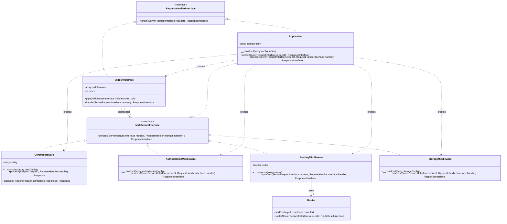

# Software Design Description (SDD) - Svensk Sport Administration

## 1. Introduction
This document describes the software design for the Svensk Sport Administration (SSA) application, focusing on the core request handling and middleware architecture defined in `Application.php`.

## 2. System Architecture
The system follows a middleware-based architecture, utilizing PSR-15 (HTTP Server Request Handlers) and PSR-7 (HTTP Message) standards. The `Application` class serves as the entry point and orchestrator for the middleware pipeline.

## 3. Class Diagram
The following UML class diagram illustrates the relationships between the core components involved in request processing.

## 4. Component Descriptions

### 4.1. Core Components
*   **Application**: The central class that implements `RequestHandlerInterface` and `MiddlewareInterface`. It initializes the middleware stack and provides a global error handling wrapper.
*   **MiddlewarePipe**: Orchestrates the execution of multiple middlewares. It implements the "Chain of Responsibility" pattern, passing the request through each registered middleware.

### 4.2. Middleware Components
*   **CorsMiddleware**: Manages Cross-Origin Resource Sharing (CORS) headers for both pre-flight (OPTIONS) and standard requests.
*   **RoutingMiddleware**: Responsible for mapping the incoming HTTP request to a specific handler using the `Router`.
*   **AuthorizationMiddleware**: Used for both authentication and authorization checks (depending on configuration).
*   **StorageMiddleware**: Handles storage-related concerns during the request lifecycle.

### 4.3. Supporting Components
*   **Router**: A utility class used by `RoutingMiddleware` to register and resolve routes based on the request URI and HTTP method.

## 5. Request Flow
1.  The `Application::handle()` method is called with a `ServerRequestInterface`.
2.  A `MiddlewarePipe` is instantiated.
3.  Standard middlewares (`Cors`, `Authentication`, `Routing`, `Authorization`, `Storage`) are instantiated and piped into the `MiddlewarePipe`.
4.  The `Application` itself is piped as the first middleware to provide error handling via its `process()` method.
5.  The `MiddlewarePipe::handle()` method is invoked, which triggers the sequential processing of all piped middlewares.
6.  Each middleware can either return a response or call `$handler->handle($request)` to pass control to the next middleware.
7.  The final response is returned back through the pipe.
